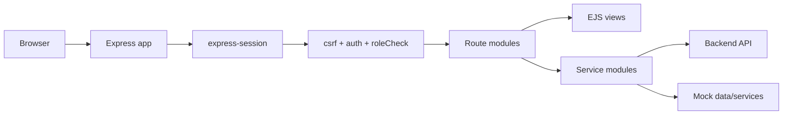
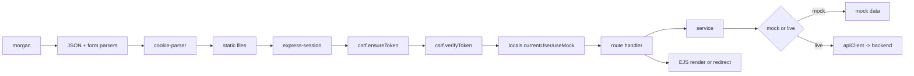
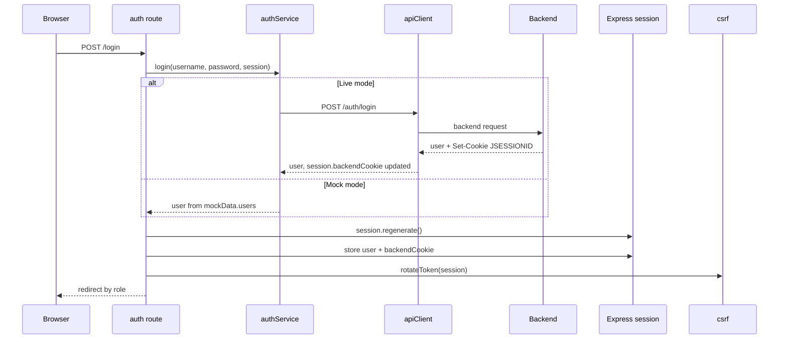
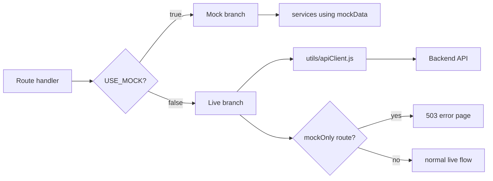
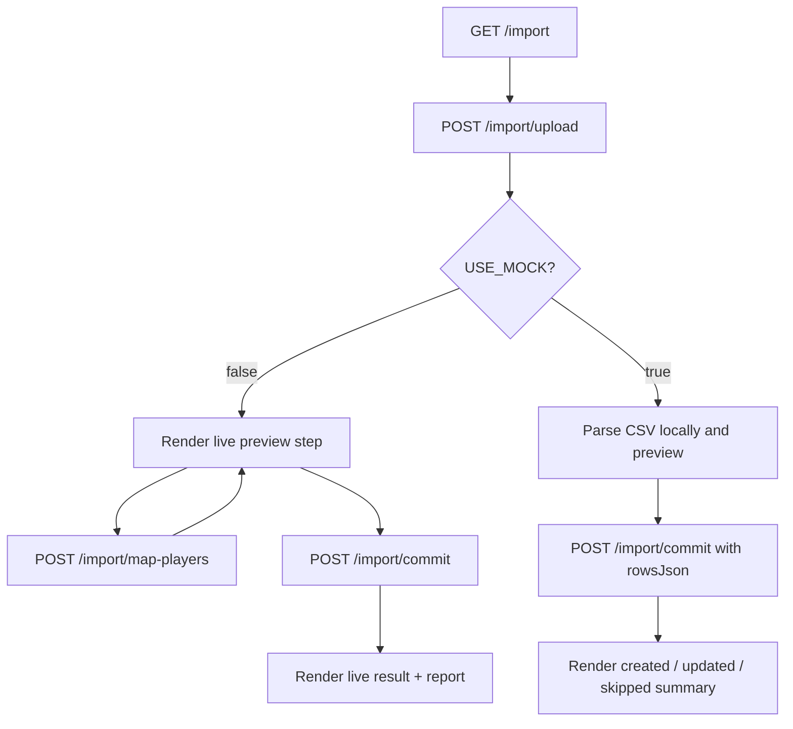

# Architecture

## 1. System Overview
This frontend is a **server-rendered Node/Express application using EJS views**. It is not a React SPA.

`app.js` wires the app with:
- `express` request handling
- `ejs` view rendering from `views\`
- `express-session` for frontend session state
- `morgan`, `cookie-parser`, JSON and URL-encoded parsers
- static asset hosting from `public\`
- custom CSRF, authentication, and role-check middleware

The frontend can run in two modes:
- **Mock mode** (`apiConfig.USE_MOCK === true`): routes/services read and mutate in-memory mock data.
- **Live mode** (`apiConfig.USE_MOCK === false`): services call the backend through `utils\apiClient.js`, forwarding the backend `JSESSIONID` in `session.backendCookie`.



## 2. Request Pipeline
`app.js` applies middleware in this order:
1. `morgan`
2. `express.json()`
3. `express.urlencoded()`
4. `cookie-parser`
5. `express.static()`
6. `express-session`
7. `csrf.ensureToken`
8. `csrf.verifyToken`
9. locals middleware that exposes `currentUser` and `useMock`
10. mounted route modules
11. 404 forwarding
12. central error handler



## 3. Mounted Route Modules
These are the route modules actually mounted by `app.js`.

| Base path | Module | Main access | Notes |
|---|---|---|---|
| `/` | `routes/auth.js` | public | `GET /login`, `POST /login`, `POST /logout` |
| `/admin` | `routes/admin.js` | `SUPER_ADMIN`, `CENTRE_ADMIN` | dashboard only |
| `/centres` | `routes/centres.js` | list: super/centre admin; mutate: super admin only | live delete is blocked |
| `/groups` | `routes/groups.js` | `SUPER_ADMIN`, `CENTRE_ADMIN` | live delete is blocked |
| `/players` | `routes/players.js` | `SUPER_ADMIN`, `CENTRE_ADMIN` | live delete is blocked |
| `/parents` | `routes/parents.js` | `SUPER_ADMIN`, `CENTRE_ADMIN` | **mock-only** parent-link management |
| `/modules` | `routes/modules.js` | list: super/centre admin; mutate: super admin only | live delete is blocked |
| `/challenges` | `routes/challenges.js` | `SUPER_ADMIN`, `CENTRE_ADMIN` | **mock-only route** |
| `/schedule` | `routes/schedule.js` | `SUPER_ADMIN`, `CENTRE_ADMIN` | **mock-only route** |
| `/progress` | `routes/progress.js` | `SUPER_ADMIN`, `CENTRE_ADMIN` | award progress and view player progress |
| `/profile` | `routes/profile.js` | `PLAYER` | `GET /profile/me` only |
| `/leaderboard` | `routes/leaderboard.js` | authenticated users | admins can filter by scope; non-admins always see global |
| `/import` | `routes/csvImport.js` | `SUPER_ADMIN` | CSV upload / preview / mapping / commit |
| `/parent` | `routes/parentArea.js` | `PARENT` | parent dashboard and linked-child detail |

### Service and utility modules referenced by these routes
Business/service modules in `services\`:
- `authService.js`
- `centreService.js`
- `challengeService.js`
- `groupService.js`
- `importService.js`
- `leaderboardService.js`
- `moduleService.js`
- `parentService.js`
- `playerService.js`
- `progressService.js`
- `scheduleService.js`
- `mockData.js` (mock data store used by several services)

Middleware/utilities used in the reviewed code:
- `middleware\auth.js`
- `middleware\csrf.js`
- `middleware\roleCheck.js`
- `utils\apiClient.js`
- `utils\mockOnly.js`

## 4. Authentication, Session, and CSRF
### Authentication and session flow
- `GET /login` renders the login page unless `req.session.user` already exists; signed-in users are redirected by role.
- `POST /login` validates username/password, then calls `authService.login(username, password, req.session)`.
- In **mock mode**, `authService` checks `mockData.users`.
- In **live mode**, `authService` posts to `/auth/login` through `apiClient`; `apiClient` captures any backend `Set-Cookie` header and stores `JSESSIONID=...` in `req.session.backendCookie`.
- After successful login, `routes/auth.js` copies `backendCookie`, calls `req.session.regenerate(...)`, restores `session.user` and `session.backendCookie`, rotates the CSRF token, saves the session, and redirects by role.
- `POST /logout` makes a best-effort backend logout call, then destroys the Express session and redirects to `/login`.

### Request-time auth checks
`middleware/auth.js` does the following:
- if `req.session.user` is missing, redirect to `/login`
- in mock mode, trust the local session and continue
- in live mode, call `authService.getCurrentUser(req.session)` on protected requests
- if the backend no longer recognises the session, clear `session.user` and `session.backendCookie`, then redirect to `/login`
- if the backend still recognises the session, merge the refreshed user fields back into `req.session.user`

### Redirect targets
- `SUPER_ADMIN` and `CENTRE_ADMIN` -> `/admin/dashboard`
- `PLAYER` -> `/profile/me`
- `PARENT` -> `/parent/dashboard`
- anonymous users hitting `/` -> `/login`

### CSRF flow
`middleware/csrf.js` is global:
- `ensureToken` creates `session.csrfToken` if needed and exposes `csrfToken`, `currentUser`, and `useMock` in `res.locals`
- `verifyToken` skips `GET`, `HEAD`, and `OPTIONS`
- for unsafe requests it accepts `_csrf` from form body, query string, or `x-csrf-token` header
- invalid or missing tokens trigger a 403 error page and rotate the token
- login success also rotates the token after session regeneration

`views/partials/nav.ejs` confirms the logout form includes the shared CSRF partial.



## 5. Role-Based Navigation and Page Access
`views/partials/nav.ejs` is role-aware and also depends on `useMock`.

### Navigation shown in `nav.ejs`
- **SUPER_ADMIN / CENTRE_ADMIN** always see:
  - Dashboard
  - Centres
  - Groups
  - Players
  - Modules
  - Award Progress
  - Leaderboard
- **SUPER_ADMIN / CENTRE_ADMIN** also see, but only when `useMock` is true:
  - Parent Links (`/parents`)
  - Challenges (`/challenges`)
  - Schedule (`/schedule`)
- **SUPER_ADMIN** additionally sees:
  - CSV Import (`/import`)
- **PLAYER** sees:
  - My Profile
  - Leaderboard
- **PARENT** sees:
  - My Children
  - Leaderboard
- The nav footer link also changes by role:
  - player -> `/profile/me`
  - parent -> `/parent/dashboard`
  - admin roles -> `/admin/dashboard`

### Route-level access rules
The route middleware is stricter than the nav in some places:
- `routes/centres.js`
  - list page: `SUPER_ADMIN`, `CENTRE_ADMIN`
  - create/edit/delete: `SUPER_ADMIN` only
- `routes/modules.js`
  - list page: `SUPER_ADMIN`, `CENTRE_ADMIN`
  - create/edit/delete: `SUPER_ADMIN` only
- `routes/groups.js`, `routes/players.js`, `routes/progress.js`
  - `SUPER_ADMIN`, `CENTRE_ADMIN`
- `routes/profile.js`
  - `PLAYER` only
- `routes/parentArea.js`
  - `PARENT` only
- `routes/csvImport.js`
  - `SUPER_ADMIN` only
- `routes/leaderboard.js`
  - any authenticated role

```mermaid
flowchart TD
    User[Authenticated user] --> Role{Role}

    Role -->|SUPER_ADMIN| SA[Admin nav + CSV import]
    Role -->|CENTRE_ADMIN| CA[Admin nav without CSV import]
    Role -->|PLAYER| PL[My Profile + Leaderboard]
    Role -->|PARENT| PA[My Children + Leaderboard]

    SA --> A1[/admin/dashboard]
    SA --> A2[/centres /groups /players /modules /progress /leaderboard]
    SA --> A3[/import]
    SA --> A4[/parents /challenges /schedule when useMock]

    CA --> C1[/admin/dashboard]
    CA --> C2[/centres /groups /players /modules /progress /leaderboard]
    CA --> C3[/parents /challenges /schedule when useMock]

    PL --> P1[/profile/me]
    PL --> P2[/leaderboard]

    PA --> P3[/parent/dashboard]
    PA --> P4[/parent/child/:id]
    PA --> P5[/leaderboard]
```

## 6. Mock vs Live Behavior
`apiConfig.USE_MOCK` changes both what data is used and which pages are available.

### Always available in both modes
These routes stay mounted in both modes, but their services switch behavior:
- `auth`
- `admin`
- `centres`
- `groups`
- `players`
- `modules`
- `progress`
- `profile`
- `leaderboard`
- `parentArea`
- `csvImport` (with very different mock/live internals)

### Explicitly mock-only pages
These route modules call `router.use(mockOnly)` and render a 503 page in live mode:
- `routes/parents.js`
- `routes/challenges.js`
- `routes/schedule.js`

### Important live-mode limitations visible in routes
- centre delete is blocked in live mode
- group delete is blocked in live mode
- player delete is blocked in live mode
- module delete is blocked in live mode
- admin dashboard live mode does not fetch challenge stats
- leaderboard filtering by centre/group is only exposed to admin roles
- parent self-service pages under `/parent` work in both modes, but use different service methods depending on mode

### Service-layer behavior
- `moduleService` supports both mock and live CRUD, but route-level delete is still blocked in live mode.
- `importService` is live-backend oriented: it only wraps backend import endpoints.
- `parentService`, `challengeService`, and `scheduleService` contain some live API calls, but route availability still matters; `/parents`, `/challenges`, and `/schedule` are not reachable in live mode because of `mockOnly`.



## 7. CSV Import Wizard
The CSV import feature lives in `routes/csvImport.js` and is mounted at `/import`. It is `SUPER_ADMIN` only.

### Step 1: upload
- `GET /import` renders step 1.
- `POST /import/upload` accepts either:
  - uploaded file field `csvFile`, or
  - pasted CSV text in `csvText`
- uploads are kept in memory via `multer.memoryStorage()` with a 2 MB limit.

### Live mode upload/preview
- the route sends the file to `importService.uploadCsv(...)`
- `importService` posts multipart data to `/admin/import/csv/upload`
- the returned preview is rendered as step 2
- step 2 may include `unmappedPlayers`; if so, the route loads player options from `playerService.getAll(...)`
- the preview rows are normalised for display by parsing `row.rawData`

### Live mode player mapping
- `POST /import/map-players` requires a `batchId`
- mappings are extracted from paired form fields named like `mappingKey_*` and `mappingValue_*`
- if no mappings are chosen, the preview is re-rendered with an error
- otherwise the route calls `importService.mapPlayers(...)` and re-renders the preview with a success message

### Live mode commit
- `POST /import/commit` requires `batchId`
- before commit, the route re-fetches preview data and refuses to continue while `preview.unmappedPlayers` is still non-empty
- once everything is mapped, it calls:
  - `importService.commit(batchId, session)`
  - `importService.getReport(batchId, session)`
- step 3 renders completion details from the live result/report

### Mock mode behavior
Mock mode does **not** use `importService`.
- upload parsing is done locally with simple `split('\n')` and `split(',')` logic
- the parser requires a header row plus at least one data row
- each row is marked with:
  - `_errors` (for example missing `displayName` or `externalRef`)
  - `_status` (`CREATE` or `UPDATE`)
  - `_existingPlayer` when the row matches an existing player by `externalRef`
- `POST /import/map-players` does not save mappings in mock mode; it just redirects back to `/import`
- `POST /import/commit` reads `rowsJson`, skips invalid rows, updates existing players through `playerService.update(...)`, creates new players through `playerService.create(...)`, and renders counts for created/updated/skipped rows



## 8. Parent, Profile, and Leaderboard Flows
### Player profile
- `/profile/me` is `PLAYER` only
- in mock mode it loads the player record, player progress, all modules, and all challenges, then derives enrolled/completed modules from awarded challenges
- in live mode it fetches `getMyProfile()` and `getMyProgress()` sequentially and renders the same page with empty `enrolledModules`/`completedModules`

### Parent area
- `/parent/dashboard` is `PARENT` only
- in live mode it loads linked players from `parentService.getLinkedPlayers(...)`
- in mock mode it uses `parentId` plus mock parent links to find children
- `/parent/child/:id` checks access before showing a child profile/progress page

### Leaderboard
- `/leaderboard` requires authentication but no specific role
- admins (`SUPER_ADMIN`, `CENTRE_ADMIN`) can request `scope=global|centre|group` and `scopeId`
- non-admin users are forced to `global` scope and empty `scopeId`
- only admins trigger the extra centre/group lookups used for filter UI

## 9. Error Handling
There are three error paths in the reviewed code:
- `middleware/roleCheck.js` renders a 403 page immediately for disallowed roles
- `middleware/csrf.js` renders a 403 page for invalid/missing tokens on unsafe requests
- `utils/mockOnly.js` renders a 503 page when a mock-only route is hit in live mode

`app.js` then provides the final 404 and generic error handling for anything passed to `next(err)`.

## 10. Local Run Notes From The Reviewed Code
From the reviewed frontend code, the local expectations are:
1. Configure `config/apiConfig` so the app has a session secret and can decide whether `USE_MOCK` is true or false.
2. Start the Node/Express frontend using the repository's normal Node entrypoint.
3. If `USE_MOCK` is **false**, start the backend first; live login, auth refresh, modules, progress, leaderboard, import, and other live service calls depend on it.
4. If `USE_MOCK` is **true**, the app can run without the backend, and mock-only pages (`/parents`, `/challenges`, `/schedule`) are available.
5. Browse to `/login`, sign in, and let the app redirect by role:
   - admin roles -> `/admin/dashboard`
   - player -> `/profile/me`
   - parent -> `/parent/dashboard`
6. State-changing form submissions must include the session CSRF token; the shared nav logout form already does this via the CSRF partial.

## 11. Practical Corrections vs. The Previous Draft
This corrected document intentionally fixes these points:
- describes the frontend as **Express + EJS**, not React
- lists the **actual mounted route modules and service filenames**
- distinguishes **`/parents`** (admin parent-link management, mock-only) from **`/parent`** (parent self-service area)
- reflects the real **session + backend cookie + CSRF rotation** login flow
- shows that nav visibility is based on **role plus `useMock`**
- shows that some actions are **route-limited even when the menu link exists**
- clarifies that **mock-only route guards** matter separately from service implementations
- documents the **real CSV import steps** implemented in `routes/csvImport.js`
- keeps local run guidance limited to what is actually supported by the reviewed frontend code
