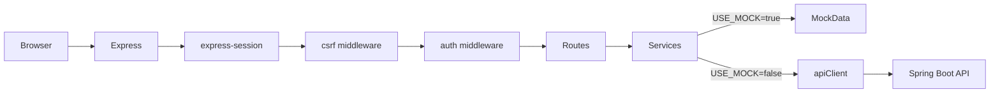
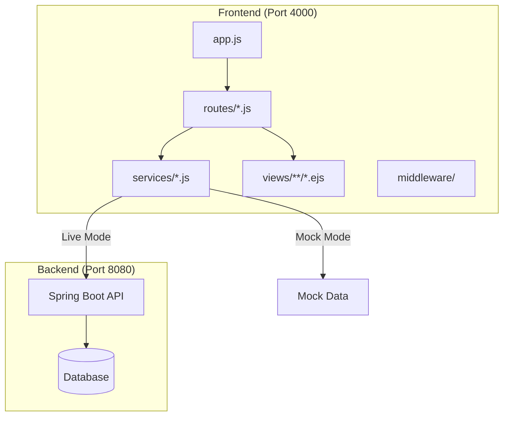
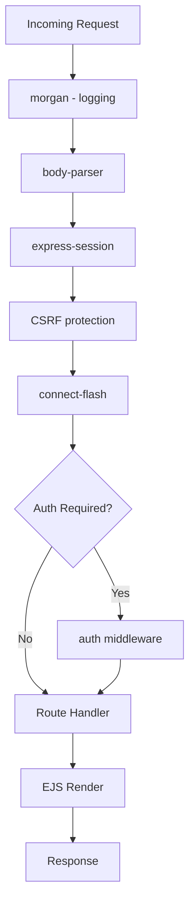

# Wishaw Frontend - Comprehensive Guide

## 1. Overview

The Wishaw frontend is a **Node.js/Express + EJS** server-rendered application designed for youth sports program management.

| Aspect | Details |
|--------|---------|
| **Runtime** | Node.js with Express framework |
| **Templating** | EJS (Embedded JavaScript) |
| **Port** | 4000 |
| **Modes** | Mock mode (standalone) or Live mode (with Spring Boot backend) |
| **Authentication** | Session-based auth forwarding JSESSIONID to backend |

### Key Features
- Centre, group, and player management
- Module and challenge tracking
- Award point system with leaderboards
- CSV import wizard for bulk data
- Parent read-only access portal

---

## 2. Architecture

### Request Flow



### Component Architecture



### Middleware Stack



### Directory Structure

```
├── app.js                 # Application entry point
├── routes/                # Route handlers
│   ├── auth.js           # Login/logout
│   ├── admin.js          # Dashboard
│   ├── centres.js        # Centre management
│   ├── groups.js         # Group management
│   ├── players.js        # Player management
│   ├── modules.js        # Module management
│   ├── challenges.js     # Challenge management
│   ├── schedule.js       # Schedule management
│   ├── progress.js       # Award points
│   ├── profile.js        # Player profile
│   ├── leaderboard.js    # Rankings
│   ├── import.js         # CSV import
│   └── parent.js         # Parent portal
├── services/             # Business logic & API calls
│   ├── apiClient.js      # HTTP client for backend
│   ├── centreService.js
│   ├── groupService.js
│   ├── playerService.js
│   └── ...
├── middleware/           # Custom middleware
│   └── auth.js           # Authentication checks
├── views/                # EJS templates
│   ├── layouts/          # Base layouts
│   ├── partials/         # Reusable components
│   └── {feature}/        # Feature-specific views
└── public/               # Static assets
    ├── css/
    └── js/
```

---

## 3. Routes Reference

### Authentication
| Route | Method | Description |
|-------|--------|-------------|
| `/login` | GET | Login page |
| `/login` | POST | Process login |
| `/logout` | GET/POST | Logout user |

### Admin Dashboard
| Route | Method | Description |
|-------|--------|-------------|
| `/admin` | GET | Admin dashboard |

### Centre Management
| Route | Method | Description |
|-------|--------|-------------|
| `/centres` | GET | List all centres |
| `/centres/new` | GET | New centre form |
| `/centres` | POST | Create centre |
| `/centres/:id` | GET | View centre |
| `/centres/:id/edit` | GET | Edit centre form |
| `/centres/:id` | POST | Update centre |
| `/centres/:id/delete` | POST | Delete centre |

### Group Management
| Route | Method | Description |
|-------|--------|-------------|
| `/groups` | GET | List all groups |
| `/groups/new` | GET | New group form |
| `/groups` | POST | Create group |
| `/groups/:id` | GET | View group |
| `/groups/:id/edit` | GET | Edit group form |
| `/groups/:id` | POST | Update group |
| `/groups/:id/delete` | POST | Delete group |

### Player Management
| Route | Method | Description |
|-------|--------|-------------|
| `/players` | GET | List all players |
| `/players/new` | GET | New player form |
| `/players` | POST | Create player |
| `/players/:id` | GET | View player |
| `/players/:id/edit` | GET | Edit player form |
| `/players/:id` | POST | Update player |
| `/players/:id/delete` | POST | Delete player |

### Content Management
| Route | Method | Description |
|-------|--------|-------------|
| `/modules` | GET | List modules |
| `/modules/:id` | GET | View module |
| `/challenges` | GET | List challenges |
| `/challenges/:id` | GET | View challenge |
| `/schedule` | GET | View schedule |

### Progress & Awards
| Route | Method | Description |
|-------|--------|-------------|
| `/progress` | GET | Progress overview |
| `/progress/award` | GET | Award points form |
| `/progress/award` | POST | Submit points |

### Player Self-Service
| Route | Method | Description |
|-------|--------|-------------|
| `/profile` | GET | Player profile |
| `/profile` | POST | Update profile |

### Leaderboard
| Route | Method | Description |
|-------|--------|-------------|
| `/leaderboard` | GET | View rankings |

### Import
| Route | Method | Description |
|-------|--------|-------------|
| `/import` | GET | Import wizard |
| `/import/upload` | POST | Upload CSV |
| `/import/preview` | GET | Preview data |
| `/import/confirm` | POST | Confirm import |

### Parent Portal
| Route | Method | Description |
|-------|--------|-------------|
| `/parent` | GET | Parent dashboard |
| `/parent/child/:id` | GET | View child progress |

---

## 4. Getting Started

### Prerequisites
- Node.js 18+ installed
- npm or yarn package manager
- (Optional) Spring Boot backend running on port 8080 for live mode

### Installation

```bash
# Navigate to project directory
cd 51a7db-tfg_hack_wishaw-node-main

# Install dependencies
npm install
```

### Running in Mock Mode (Standalone)

Mock mode uses local mock data - no backend required.

```bash
npm start
```

The app will be available at: `http://localhost:4000`

### Running in Live Mode (With Backend)

Live mode connects to the Spring Boot backend API.

```bash
# Windows PowerShell
$env:USE_MOCK="false"; $env:SESSION_SECRET="your-secret-key"; npm start

# Windows CMD
set USE_MOCK=false && set SESSION_SECRET=your-secret-key && npm start

# Linux/Mac
USE_MOCK=false SESSION_SECRET=your-secret-key npm start
```

**Requirements for Live Mode:**
- Spring Boot backend running on `http://localhost:8080`
- Valid `SESSION_SECRET` environment variable
- Backend API endpoints accessible

### Environment Variables

| Variable | Default | Description |
|----------|---------|-------------|
| `PORT` | 4000 | Server port |
| `USE_MOCK` | true | Use mock data (true) or backend API (false) |
| `SESSION_SECRET` | (dev default) | Session encryption secret |
| `API_BASE_URL` | http://localhost:8080 | Backend API URL |

---

## 5. How to Enhance

### Adding a New Route

1. **Create route file** in `routes/`:

```javascript
// routes/myfeature.js
const express = require('express');
const router = express.Router();
const myFeatureService = require('../services/myFeatureService');
const { requireAuth } = require('../middleware/auth');

router.get('/', requireAuth, async (req, res) => {
    try {
        const data = await myFeatureService.getAll();
        res.render('myfeature/index', { data });
    } catch (error) {
        req.flash('error', 'Failed to load data');
        res.redirect('/admin');
    }
});

module.exports = router;
```

2. **Register route** in `app.js`:

```javascript
const myFeatureRoutes = require('./routes/myfeature');
app.use('/myfeature', myFeatureRoutes);
```

### Adding a New Service

1. **Create service file** in `services/`:

```javascript
// services/myFeatureService.js
const apiClient = require('./apiClient');

const USE_MOCK = process.env.USE_MOCK !== 'false';

// Mock data for development
const mockData = [
    { id: 1, name: 'Item 1' },
    { id: 2, name: 'Item 2' }
];

module.exports = {
    async getAll() {
        if (USE_MOCK) {
            return mockData;
        }
        return apiClient.get('/api/myfeature');
    },

    async getById(id) {
        if (USE_MOCK) {
            return mockData.find(item => item.id === parseInt(id));
        }
        return apiClient.get(`/api/myfeature/${id}`);
    },

    async create(data) {
        if (USE_MOCK) {
            const newItem = { id: mockData.length + 1, ...data };
            mockData.push(newItem);
            return newItem;
        }
        return apiClient.post('/api/myfeature', data);
    },

    async update(id, data) {
        if (USE_MOCK) {
            const index = mockData.findIndex(item => item.id === parseInt(id));
            if (index !== -1) {
                mockData[index] = { ...mockData[index], ...data };
                return mockData[index];
            }
            return null;
        }
        return apiClient.put(`/api/myfeature/${id}`, data);
    },

    async delete(id) {
        if (USE_MOCK) {
            const index = mockData.findIndex(item => item.id === parseInt(id));
            if (index !== -1) {
                mockData.splice(index, 1);
                return true;
            }
            return false;
        }
        return apiClient.delete(`/api/myfeature/${id}`);
    }
};
```

### Adding Views

1. **Create view directory** in `views/`:

```
views/
└── myfeature/
    ├── index.ejs      # List view
    ├── show.ejs       # Detail view
    ├── new.ejs        # Create form
    └── edit.ejs       # Edit form
```

2. **Example view template**:

```ejs
<%- include('../layouts/header') %>

<div class="container">
    <h1>My Feature</h1>
    
    <% if (locals.flash && flash.success) { %>
        <div class="alert alert-success"><%= flash.success %></div>
    <% } %>
    
    <table class="table">
        <thead>
            <tr>
                <th>ID</th>
                <th>Name</th>
                <th>Actions</th>
            </tr>
        </thead>
        <tbody>
            <% data.forEach(item => { %>
            <tr>
                <td><%= item.id %></td>
                <td><%= item.name %></td>
                <td>
                    <a href="/myfeature/<%= item.id %>" class="btn btn-sm btn-info">View</a>
                    <a href="/myfeature/<%= item.id %>/edit" class="btn btn-sm btn-warning">Edit</a>
                </td>
            </tr>
            <% }); %>
        </tbody>
    </table>
    
    <a href="/myfeature/new" class="btn btn-primary">Add New</a>
</div>

<%- include('../layouts/footer') %>
```

### Adding Middleware

```javascript
// middleware/myMiddleware.js
module.exports = {
    checkPermission(permission) {
        return (req, res, next) => {
            if (req.session.user && req.session.user.permissions.includes(permission)) {
                return next();
            }
            req.flash('error', 'Permission denied');
            res.redirect('/admin');
        };
    }
};
```

---

## 6. Known Limitations

### Partially Mock-Only Features

| Feature | Status | Notes |
|---------|--------|-------|
| **Challenges** | Mock-only | CRUD operations not implemented in backend |
| **Schedule** | Mock-only | Schedule management not in backend |
| **Import Wizard** | Partial | CSV parsing works, backend import endpoints may vary |

### Missing Backend Operations

| Operation | Affected Entities | Workaround |
|-----------|-------------------|------------|
| DELETE | All entities | Use soft-delete or disable in UI |
| Bulk operations | Players, Groups | Process individually |

### Session Handling

- JSESSIONID forwarding requires backend to accept session cookies
- Session timeout sync between frontend and backend not implemented
- Cross-origin session sharing requires proper CORS configuration

### Known Issues

1. **Flash messages** may not persist across redirects in some edge cases
2. **File uploads** (CSV import) limited to 10MB by default
3. **Concurrent edits** not handled - last write wins

### Browser Support

- Modern browsers (Chrome, Firefox, Edge, Safari)
- IE11 not supported

---

## Appendix: Quick Reference

### Common Commands

```bash
# Development
npm start                    # Start in mock mode
npm run dev                  # Start with nodemon (auto-reload)

# Production
NODE_ENV=production npm start

# Testing
npm test                     # Run tests
npm run test:coverage        # Run with coverage
```

### Default Credentials (Mock Mode)

| Role | Username | Password |
|------|----------|----------|
| Admin | admin | admin123 |
| Coach | coach | coach123 |
| Player | player1 | player123 |
| Parent | parent1 | parent123 |

### API Client Usage

```javascript
const apiClient = require('./services/apiClient');

// GET request
const data = await apiClient.get('/api/endpoint');

// POST request
const result = await apiClient.post('/api/endpoint', { key: 'value' });

// With session forwarding
const data = await apiClient.get('/api/endpoint', { 
    headers: { Cookie: `JSESSIONID=${req.session.jsessionid}` }
});
```

---

*Last updated: Auto-generated documentation*
